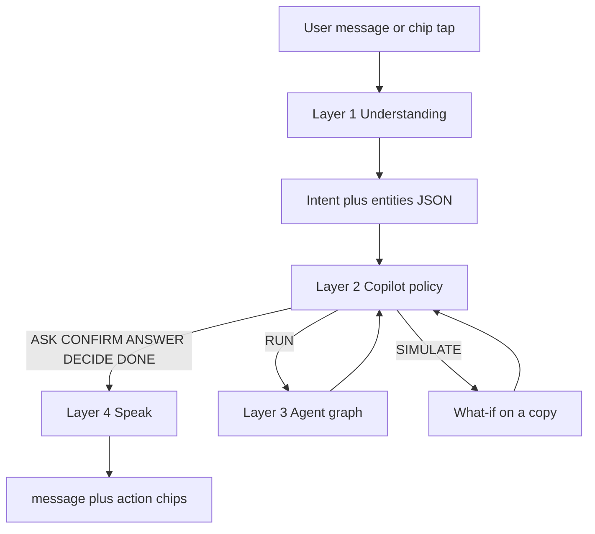
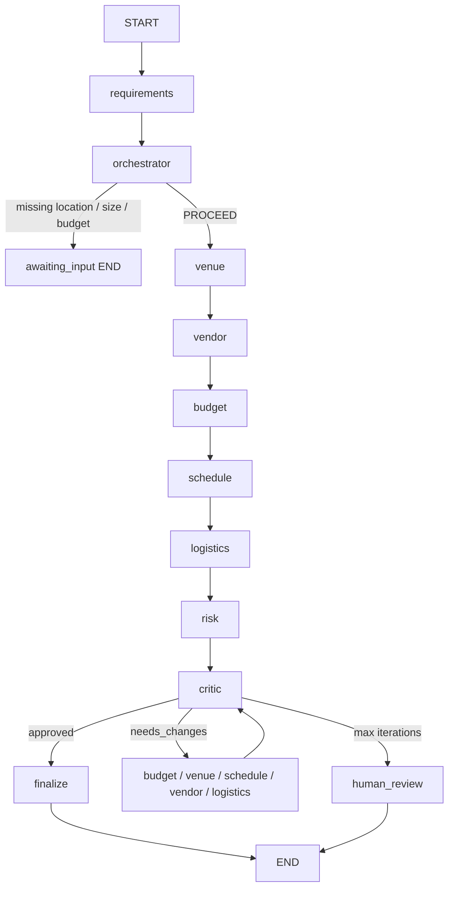

# EventOS

EventOS is a multi-agent event planner. You describe an event; specialized agents search venues and vendors, build a budget and schedule, score risks, and a critic either approves the plan or sends work back. A copilot sits in front of that graph so the system asks, confirms, and offers choices instead of silently firing agents.

This is not a chatbot that writes one document from a prompt. **The LLM interprets and talks. Python owns state, validation, and whether anything runs. Domain agents own the plan.**

---

## What you do in the product

1. **Create an event** from the dashboard (**New event**). A blank draft has no city, headcount, duration, or budget.
2. **Open AI Planner** and talk in normal language (typos are fine: “alexendria, 400 attendee, 2 days, 2000$”).
3. The copilot **asks** for missing critical fields, then for date / indoor-or-outdoor (and hotels on conferences). You can **skip extras**. Agents do not run until you tap **Proceed**.
4. Watch the **agent strip** while Requirements → Venue → Vendor → Budget → Schedule → Logistics → Risk → Critic run.
5. When the graph finishes you get either a **DONE** summary or **DECIDE** chips (cheaper venue, raise budget, put registration in the foyer, keep draft). Nothing fails silently as `needs_human_review`.
6. Inspect **Budget**, **Timeline**, **Venues**, **Vendors**, **Risks**. Ask a what-if (“What if attendance 800?”). That runs on a **copy**; Apply / Discard decides whether the live plan changes.

The seeded **AI Future Summit 2026** (Cairo, 500 people, 3 days, $30,000) is still there if you want a filled example. New events do not copy it.

---

## Golden rule

| Job | Owner |
|-----|--------|
| Understand messy user text | LLM (Layer 1), with heuristics only if the LLM fails |
| Decide ASK vs CONFIRM vs RUN vs DECIDE | Python copilot (Layer 2) |
| Venue / budget math / schedule / conflicts | Specialist agents + tools (Layer 3) |
| Word the reply | LLM (Layer 4); it may not invent new action buttons |
| Persist plan, chat, agent traces | FastAPI + SQLAlchemy |

If Layer 1 says “plan” but budget is missing, Layer 2 still **ASK**. The LLM cannot enqueue the graph.

---

## How a chat turn works (four layers)



### Layer 1 — Understanding

`POST /api/chat` sends the text (and optional `action_id` from a chip) through `understand_message`.

Output is structured JSON (`UnderstoodMessage`):

- **intent:** `plan`, `confirm`, `edit`, `question`, `what_if`, `decide`
- **entities:** `event_type`, `location`, `attendees`, `duration_days`, `budget`, `currency` — `null` if not stated (numbers and cities are not invented)
- **simulate_patch:** e.g. `{ "attendees": 800 }`
- **action_id:** `proceed`, `cheaper_venue`, `raise_budget`, `registration_foyer`, `keep_draft`, `apply_sim`, `discard_sim`, …

Python then validates types (attendees int, budget number) and drops values that never appeared in the message.

### Layer 2 — Copilot policy (pure Python)

Persisted on the event as `copilot_state`:

- **phase:** `intake` → `confirm` → `running` → `decide` or `done`
- **requirements** and **missing_fields** (critical: location, attendees, duration_days, budget; then date, indoor/outdoor, hotels unless skipped)
- **skipped_specialized:** organizer chose defaults instead of extra questions
- **graph_status:** idle, queued, running, approved, awaiting_input, needs_human_review
- **available_actions:** chips generated by code, not by the LLM

Exactly one policy per turn:

| Policy | When |
|--------|------|
| **ASK** | Critical fields missing, or extras (date / format / overnight) not yet answered |
| **CONFIRM** | Brief complete (or extras skipped); waiting for Proceed |
| **RUN** | User confirmed / `proceed` (or a decide chip that means replan) → `worker.enqueue` |
| **ANSWER** | Question about status / snapshot; no enqueue |
| **SIMULATE** | What-if with a numeric patch; then Apply / Discard |
| **DECIDE** | Graph stopped with `awaiting_input` or `needs_human_review` |
| **DONE** | Graph terminal `approved` |

### Layer 3 — Agent graph

Nine specialists share a typed `EventState`. They do not chat with the user. The worker runs the graph to a **terminal** state (no LangGraph interrupt/checkpointer in v1), writes status back into the copilot, then Layer 4 posts an assistant message.

### Layer 4 — Speak

The LLM turns the policy + structured facts into a short message. Action ids stay the ones Layer 2 chose. If generation fails, a Python template is used.

The planner renders `ChatOut.actions` as chips. Tapping a chip posts `{ action_id }`. On SSE `plan_completed`, the UI refetches chat so DONE / DECIDE is not lost.

---

## How the agent graph works



| Agent | What it does |
|-------|----------------|
| **Requirements** | Parse the brief into `EventRequirements`. Must not invent critical fields. Records remaining specialized gaps (date, format). |
| **Orchestrator** | If anything critical is missing → `awaiting_input` and stop. Else proceed. |
| **Venue** | `venue_search` (mock catalog or OpenStreetMap). Results are cached in `research_records` + the venues table until the query changes or TTL expires. |
| **Vendor** | `vendor_search` per category; same cache/persist behavior. |
| **Budget** | `budget_calculator` — **Python arithmetic only**. Live FX via Frankfurter when mock tools are off; rates are cached. |
| **Schedule** | Multi-day program. Registration lives in the **foyer**, sessions in the hall, lunch in dining, so Registration vs AV do not clash in the same room. `schedule_conflict_checker` flags leftover overlaps. |
| **Logistics** | Transport, staff, load-in; `weather_lookup` (Open-Meteo when live) + `web_research` local notes, both cached. |
| **Risk** | Rule-based `risk_checker`, plus cached weather/local research. |
| **Critic** | Structured issues + score. Approve, or route the highest-priority issue back to one specialist. After `MAX_ITERATIONS` (default 5) → `needs_human_review` with the best plan kept. |
| **Finalize** | Persist `plan_snapshot` and emit `plan_completed`. |

Each node is wrapped so **agent_runs** store status, task, summaries, duration, and errors. The UI polls those rows and also listens to SSE: `agent_started`, `agent_completed`, `agent_failed`, `critic_issue`, `plan_completed`.

Pipeline cards on the planner/dashboard show the **latest plan job only**, so an old failed Risk run cannot cover a new successful one.

---

## Tools vs live data

`USE_MOCK_TOOLS=true` (default) uses the mock catalog and mock weather. Set it to `false` to search for real:

- **Venues / vendors:** OpenStreetMap Nominatim (no API key)
- **Weather:** Open-Meteo (no API key)
- **FX:** Frankfurter (no API key)
- **Web notes:** Brave Search if `SEARCH_API_KEY` is set

Every lookup is stored in **research_records** (and venues/vendors tables). The same city + size + type is not searched again until the cache expires (venues/vendors 7 days, weather 6 hours) or the brief changes (new location, headcount, date). Venue replan forces a refresh. Results stay tagged `source_type=mock` or `live`; replayed rows set `from_cache=true`.

The graph does not silently substitute mock data when live mode is on. If a live API is down, that tool fails.

---

## LLM

Set in `.env` (never sent to the browser):

```
LLM_PROVIDER=   # mock | groq | openai_compatible | gemini
LLM_MODEL=
LLM_API_KEY=
LLM_BASE_URL=
```

`mock` is the default for tests and a no-key deploy. Requirements parsing and copilot still work; the graph uses deterministic tools. If `LLM_API_KEY` is empty, EventOS stays on mock even when another provider is named.

Keep **one API replica**. Planning jobs and SSE live in that process (Redis is for future workers, not required for a single-host deploy).

---

## Data that gets saved

On API startup, tables are created and seed data is applied (demo user, mock venues/vendors, AI Future Summit).

**Events** hold the brief, status, `plan_snapshot` (JSON of the last graph result), and `copilot_state`. Related rows: requirements payload, budget lines, schedule items, risks, **agent_runs**, **chat_messages** (including action chips in `extra`), **simulations** (what-if copies), **plan_jobs**, **research_records** (cached venue/vendor/weather/web lookups).

Migrations live in `backend/alembic`. SQLite is supported for local use; Postgres + pgvector is used in Docker.

---

## Screens

| Place | Role |
|-------|------|
| **Dashboard** | Stats, featured event, **New event**, list of all events |
| **Event overview** | Brief, budget snapshot, risks, jump to planner |
| **AI Planner** | Mission banner (copilot **phase**), agent strip, chat + chips |
| **Venues / Vendors / Budget / Timeline / Risks / Agents** | Read the persisted plan and traces |

**Web:** Vite + React + Tailwind (`frontend/`). Dev server proxies `/api` to port 8000.

**Phone:** Expo app in `mobile/` talks to the same FastAPI on your LAN (not a WebView). API must bind `--host 0.0.0.0`. Connect screen if the phone cannot reach the API.

---

## Setup

### Docker

```bash
cp .env.example .env
docker compose up --build
```

- UI: http://localhost:5173
- API: http://localhost:8000
- Liveness: http://localhost:8000/api/health
- Readiness (DB): http://localhost:8000/api/health/ready
- Docs: http://localhost:8000/docs

Set `DEBUG=false` in `.env` for a deploy. Docker Compose maps host `DATABASE_URL` to the `postgres` service automatically so local URLs in `.env` do not break the containers.

### Local (SQLite, two terminals)

```bash
cd backend
python -m venv .venv
# Windows: .venv\Scripts\activate
pip install -r requirements.txt
```

```bash
# terminal 1 — API
cd backend
set DATABASE_URL=sqlite+aiosqlite:///./eventos.sqlite
# PowerShell: $env:DATABASE_URL='sqlite+aiosqlite:///./eventos.sqlite'
# load LLM_* from repo .env if you use Gemini / OpenAI
uvicorn app.main:app --reload --host 0.0.0.0 --port 8000
```

```bash
# terminal 2 — web
cd frontend
npm install
npm run dev
```

Open http://localhost:5173. For Postgres instead of SQLite, use the URL in `.env.example`.

### Expo (optional)

API already on `0.0.0.0:8000`, then:

```bash
cd mobile
npx expo start --lan
```

Scan with Expo Go. If connect fails, set the API to `http://<your-LAN-IP>:8000`.

### Environment

See [.env.example](.env.example). Keep `USE_MOCK_TOOLS=true` unless you want live OSM / Open-Meteo / FX.

---

## API (process-shaped)

| Method | Path | Process |
|--------|------|---------|
| POST | `/api/events` | Create a draft (blank fields stay missing for the copilot) |
| GET | `/api/events`, `/api/events/{id}` | List / load; `copilot_state` is hydrated for phase + chips |
| POST | `/api/chat` | Understand → policy → maybe enqueue or simulate → speak |
| GET | `/api/events/{id}/chat` | History including `actions` on assistant rows |
| POST | `/api/events/{id}/plan` | Queue the graph without going through chat confirm |
| GET | `/api/events/{id}/agents` | Agent traces |
| GET | `/api/events/{id}/agents/stream` | SSE |
| GET | `/api/events/{id}/budget` `/schedule` `/risks` | Slices of `plan_snapshot` |
| POST | `/api/events/{id}/simulate` | What-if on a copy |
| GET | `/api/venues` `/api/vendors` | Mock catalog |
| GET | `/api/health` | Liveness |
| GET | `/api/health/ready` | Database ping |

Chat body: `{ "message": "...", "event_id": "...", "action_id": "proceed" }`.  
Chat response includes `reply`, `phase`, `policy`, `missing_fields`, `actions`, optional `run_id` / `simulation`.

---

## Walkthrough

**Blank event**

1. Dashboard → **New event** → name it → Create and open planner.
2. Phase is **intake**. Type the brief or tap the missing-field chips.
3. When all four fields exist, phase is **confirm**. Tap **Proceed**.
4. Phase **running**. When SSE `plan_completed` fires, chat refetches: **done** or **decide**.

**Seeded summit**

1. Open AI Future Summit → AI Planner.
2. Proceed (or “Plan this event”).
3. If a leftover clash exists, use **Put registration in the foyer** (or the graph may already approve after the foyer schedule).

**What-if**

“What if attendance increases to 800?” → simulation on a copy → **Apply to live plan** / **Keep original plan**.

---

## Tests

```bash
cd backend
pytest
```

Covers validation, budget math, schedule conflicts (including foyer registration), critic routing, max iterations, full-graph approve, over-budget replan, chat heuristics, and copilot ASK / CONFIRM / RUN / DECIDE.

---

## Project layout

```
/backend     FastAPI, LangGraph, agents, tools, copilot, worker
/frontend    Vite + React dashboard and planner
/mobile      Expo Go client (same API)
/UI          Archived HTML mockups
```

Useful backend entry points:

- Chat pipeline: `backend/app/api/routes.py` (`POST /chat`)
- Understand / policy / speak: `backend/app/services/understand.py`, `copilot.py`, `copilot_speak.py`
- Graph: `backend/app/graph/builder.py`
- Worker callback (DECIDE / DONE after the graph): `backend/app/workers/planner.py`
- Agents: `backend/app/agents/`
- Tools: `backend/app/tools/`
